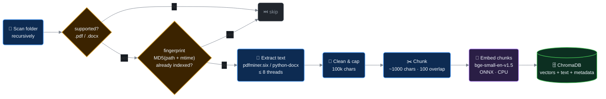

# ODF — Offline Document Finder

> **Search like you think.** A local-first, AI-powered semantic search engine for your documents — fully offline, no cloud, no telemetry.

[](https://github.com/7pk5/ODF/actions/workflows/build-windows.yml)
[](https://www.python.org/)
[](LICENSE)
[]()
[]()

<!-- TODO: replace with an actual screenshot/GIF of the search overlay -->
<!--  -->

---

## Table of Contents

- [The Problem](#the-problem)
- [How ODF Solves It](#how-odf-solves-it)
- [Key Features](#key-features)
- [Architecture](#architecture)
- [How It Works](#how-it-works)
  - [Indexing Pipeline](#1-indexing-pipeline)
  - [Search Pipeline](#2-search-pipeline)
- [Technology Stack](#technology-stack)
- [Getting Started](#getting-started)
- [Usage](#usage)
- [Data Storage & Privacy](#data-storage--privacy)
- [Performance](#performance)
- [Known Limitations](#known-limitations)
- [Roadmap](#roadmap)
- [Project Structure](#project-structure)
- [Contributing](#contributing)
- [License](#license)

---

## The Problem

Traditional file search is **keyword search**: it matches exact strings in filenames or content. If you saved a file as `2023_Financial_Review.pdf` and later search for *"budget report"*, you find nothing — even though that file is exactly what you wanted.

Humans remember documents by **what they are about**, not by what they were named.

## How ODF Solves It

ODF reads the actual content of your PDF and Word documents, converts it into **embedding vectors** (mathematical representations of meaning) using a small on-device AI model, and stores them in a local vector database. When you search, your query is embedded the same way and matched by **semantic similarity** — concept to concept, not string to string.

| You search for | ODF finds |
|---|---|
| `invoice from last quarter` | `Q3_Billing_Final_v2.pdf` |
| `machine learning notes` | `CS_Lecture_7.docx` |
| `contract renewal date` | `lease_agreement.pdf` |

Everything — text extraction, embedding, storage, retrieval — runs **on your CPU, on your machine**. The only network access ever made is a one-time model download (~130 MB) on first launch.

## Key Features

- **Semantic search** — natural-language queries over document *content*, powered by the `BAAI/bge-small-en-v1.5` embedding model (384-dim, ONNX, CPU-only).
- **Exact-match boosting** — results whose filename or text literally contain the query are boosted above pure-semantic matches, so ID-style lookups (`INV-2024-001`) still rank first.
- **Spotlight-style overlay UI** — a borderless, always-on-top search bar (CustomTkinter) summoned from anywhere with a global **Ctrl+K** hotkey.
- **Incremental indexing** — files are fingerprinted with `MD5(path + mtime)`; unchanged files are skipped on re-index, and entries for deleted files are cleaned up automatically.
- **Parallel ingestion** — text extraction runs on up to 8 worker threads; the UI never blocks (search, indexing, and model loading all run off the main thread).
- **Persistent local index** — ChromaDB with HNSW (cosine) storage on disk; index once, search forever.
- **Single-file Windows EXE** — built with PyInstaller via `build_exe.py`, or automatically by CI on every version tag.

## Architecture

ODF is a three-layer desktop application. The UI layer never talks to storage directly — all retrieval flows through the engine layer.

```mermaid
%%{init: {
  'theme': 'base',
    'themeCSS': '.node rect, .node circle, .node polygon, .node path { filter: drop-shadow(2px 4px 5px rgba(0,0,0,0.55)); } .cluster rect { filter: drop-shadow(3px 6px 8px rgba(0,0,0,0.45)); } .cluster-label span { color: #e6edf3; font-weight: 600; } .edgeLabel span { color: #adbac7; }',
  'flowchart': { 'curve': 'basis', 'nodeSpacing': 50, 'rankSpacing': 60 },
  'themeVariables': {
    'fontFamily': 'Segoe UI, Helvetica, Arial, sans-serif',
    'fontSize': '13px',
    'lineColor': '#7d8590',
    'textColor': '#adbac7',
    'edgeLabelBackground': '#161b22',
    'clusterBorder': '#30363d'
  }
}}%%
flowchart TB
    subgraph UI["&nbsp;🖥️ Presentation Layer · ui/&nbsp;"]
        HK(["⌨️ Global Hotkey<br/>Ctrl+K · keyboard lib"])
        SW("🔍 SearchWindow<br/>CustomTkinter overlay")
    end

    subgraph ENGINE["&nbsp;⚙️ Engine Layer · search_engine/&nbsp;"]
        FI("📂 FileIndexer<br/>scan · extract · fingerprint")
        VS("🧭 VectorSearch<br/>chunk · retrieve · rank")
        EMB("🧠 Embedder<br/>FastEmbed · ONNX · CPU<br/>bge-small-en-v1.5")
    end

    subgraph STORAGE["&nbsp;💾 Storage Layer · local disk&nbsp;"]
        DB[("🗄️ ChromaDB<br/>HNSW · cosine")]
        FS[("📄 File System<br/>PDF / DOCX")]
    end

    HK -->|toggle| SW
    SW -->|index folder| FI
    SW -->|search query| VS
    FI -->|read files| FS
    FI -->|documents + metadata| VS
    VS <-->|embed text| EMB
    VS <-->|upsert / query| DB
    SW -.->|open result| FS

    classDef uiNode fill:#0d2b52,stroke:#58a6ff,stroke-width:1.5px,color:#f0f6fc
    classDef engineNode fill:#2a1e45,stroke:#bc8cff,stroke-width:1.5px,color:#f0f6fc
    classDef storeNode fill:#0c2f21,stroke:#3fb950,stroke-width:1.5px,color:#f0f6fc
    class HK,SW uiNode
    class FI,VS,EMB engineNode
    class DB,FS storeNode

    style UI fill:#0d1420,stroke:#30363d,stroke-width:1px
    style ENGINE fill:#131020,stroke:#30363d,stroke-width:1px
    style STORAGE fill:#0c1512,stroke:#30363d,stroke-width:1px
```



**Design principles**

1. **Local-first** — no server, no API keys, no data egress. The vector DB is an embedded library, not a service.
2. **CPU-only inference** — ONNX Runtime instead of PyTorch keeps the dependency footprint small and makes the app run on any laptop, no GPU or CUDA required.
3. **Non-blocking UI** — every expensive operation (model load, indexing, search) runs in a background thread and reports back via the Tk event loop.

## How It Works

### 1. Indexing Pipeline

Triggered from the UI (*"＋ Index Folder"*). Run it once per folder; subsequent runs only process new or modified files.



| Stage | Detail |
|---|---|
| **Scan** | Walks the tree, pruning hidden folders (`.*`), dev folders (`node_modules`, `venv`, `__pycache__`, …) and Windows system paths. |
| **Fingerprint** | `MD5(filepath + mtime)` per file. Matching fingerprints are skipped — this is what makes re-indexing cheap. Stale entries for files deleted from disk are removed before each run. |
| **Extract** | `pdfminer.six` for PDF text layers; `python-docx` for paragraphs *and* table cells. Runs on a thread pool (up to 8 workers). |
| **Chunk** | Documents are split into ~1,000-character chunks with 100-character overlap, breaking at paragraph/sentence boundaries where possible. |
| **Embed & store** | Chunks are embedded in batches and upserted into a persistent ChromaDB collection configured for cosine similarity (HNSW index). |

### 2. Search Pipeline

Runs on every keystroke, debounced by 280 ms, minimum 2 characters.


1. **Retrieve** — the query vector is compared against all chunk vectors via HNSW approximate nearest-neighbour search; 24 candidates are fetched (3× the display count) to give the ranking stage room to work.
2. **Boost** — candidates containing the query as an exact substring get a score bonus: **+0.25** if it appears in the filename, **+0.15** if in the chunk text (final score capped at 1.0).
3. **Rank & render** — candidates are re-sorted by boosted score; the top 8 are shown with filename, path, match score, metadata, and a content preview. `Enter` opens the file in its OS-default application.

> The over-fetch → boost → re-rank design means a semantic search for *"invoices"* surfaces `Billing_2024.pdf`, while an exact lookup like `INV-2024-001` forces that precise document to the top.

## Technology Stack

| Concern | Choice | Why |
|---|---|---|
| Embeddings | [FastEmbed](https://github.com/qdrant/fastembed) + `BAAI/bge-small-en-v1.5` | Strong English retrieval quality at 33M params; ONNX Runtime = fast CPU inference, no PyTorch (~1 GB saved) |
| Vector store | [ChromaDB](https://www.trychroma.com/) (embedded, persistent) | HNSW ANN search, zero-config local persistence, no server process |
| PDF extraction | `pdfminer.six` | Pure-Python, permissive license, reliable text-layer extraction |
| DOCX extraction | `python-docx` | Paragraphs + tables |
| UI | [CustomTkinter](https://customtkinter.tomschimansky.com/) | Modern dark UI on top of stdlib Tkinter — tiny footprint vs Electron/Qt |
| Global hotkey | `keyboard` | OS-level Ctrl+K registration |
| Packaging | PyInstaller (`build_exe.py`) + GitHub Actions | One-file Windows EXE, built automatically on version tags |

## Getting Started

### Option A — Download the EXE (Windows, no Python required)

1. Grab `ODF.exe` from the [latest release](https://github.com/7pk5/ODF/releases).
2. Double-click. First launch downloads the embedding model (~130 MB, one time) and may take 20–30 s to unpack.

> **Note:** PyInstaller binaries occasionally trigger antivirus false positives. The build is reproducible from source via `build_exe.py` or the CI workflow.

### Option B — Run from source (Windows / macOS / Linux)

```bash
git clone https://github.com/7pk5/ODF.git
cd ODF

python -m venv venv
source venv/bin/activate        # Windows: venv\Scripts\activate

pip install -r requirements.txt
python main.py
```

Requires Python 3.8+. The embedding model is downloaded to `./models/` on first run.

### Option C — Build the EXE yourself

```bash
python build_exe.py             # produces dist/ODF.exe
```

CI builds the same artifact on every `v*` tag and attaches it to the GitHub Release.

## Usage

| Action | How |
|---|---|
| Show / hide overlay | **Ctrl+K** (global, works from any app) |
| Index documents | Click **＋ Index Folder**, pick a directory |
| Search | Just type (min 2 characters) |
| Navigate results | **↑ / ↓** |
| Open selected file | **Enter** or click **Open File →** |
| Hide window | **Esc** |
| Move window | Drag anywhere on the frame |

**Typical workflow:** launch → Ctrl+K → index your `Documents` folder once → search naturally from then on. Re-index the same folder anytime to pick up new files; unchanged files are skipped automatically.

> **Hotkey permissions:** the global hotkey may require running as Administrator on some Windows setups, and Accessibility/input permissions on macOS/Linux (a limitation of OS-level key hooks).

## Data Storage & Privacy

| Artifact | Script mode | Packaged EXE |
|---|---|---|
| Vector index | `./data/chroma_db/` | `%APPDATA%/ODF/data/chroma_db/` |
| Embedding model cache | `./models/` | `%APPDATA%/ODF/models/` |
| Log file | `./odf.log` | `%APPDATA%/ODF/odf.log` |

- Your documents are **never copied, moved, or uploaded**. The index stores extracted text chunks, their vectors, and file paths — nothing else.
- No telemetry, no analytics, no network calls after the one-time model download.
- To wipe everything, delete the index directory above and re-launch.

## Performance

Measured characteristics on a typical 4-core laptop CPU (no GPU):

| Metric | Value |
|---|---|
| Idle memory (model loaded) | ~400–600 MB |
| Indexing throughput | ~50 average PDFs in 1–3 min (embedding-bound) |
| Search latency | 0.3–2 s from last keystroke, growing slowly with index size (HNSW, not linear scan) |
| Index disk footprint | ~30–80 MB per 1,000 documents |

## Known Limitations

| Limitation | Detail |
|---|---|
| **File types** | `.pdf` and `.docx` only. No XLSX/PPTX/TXT/images yet. |
| **Scanned PDFs** | Image-only PDFs have no text layer and are skipped (no OCR yet — see [Roadmap](#roadmap)). |
| **Language** | The embedding model is optimised for English; other languages work with reduced accuracy. |
| **Content cap** | Extraction is capped at 100,000 characters per file (~50–70 pages). |
| **Protected files** | Password-protected PDFs and encrypted DOCX cannot be read. |
| **Filters** | No date/type/folder filtering in search yet — all indexed content is searched together. |
| **EXE platform** | The packaged binary targets Windows; macOS/Linux users run from source. |

## Roadmap

Planned retrieval-quality improvements, in priority order:

1. **True hybrid retrieval** — BM25 keyword search (SQLite FTS5) fused with vector search via Reciprocal Rank Fusion, replacing substring boosting.
2. **Stale-entry hygiene** — automatic removal of superseded chunks when a modified file is re-indexed.
3. **File-level result grouping** — dedupe chunks so one long document can't crowd out other relevant files.
4. **Cross-encoder re-ranking** — a small ONNX re-ranker over the top candidates for sharper ordering.
5. **OCR support** — optional RapidOCR (ONNX) pass for scanned PDFs.
6. **More formats** — TXT, XLSX, PPTX.
7. **Search filters** — by file type, date range, and source folder.

## Project Structure

```
ODF/
├── main.py                     # Entry point: logging, hotkey, crash handling
├── build_exe.py                # PyInstaller build script → dist/ODF.exe
├── requirements.txt
├── ui/
│   └── search_window.py        # Spotlight-style overlay (CustomTkinter)
├── search_engine/
│   ├── embedder.py             # FastEmbed wrapper (bge-small-en-v1.5, ONNX)
│   ├── file_indexer.py         # Folder scan, text extraction, fingerprinting
│   └── vector_search.py        # ChromaDB store, chunking, retrieval + ranking
├── utils/
│   ├── open_file.py            # Cross-platform "open with default app"
│   └── platform_paths.py       # OS-appropriate data/model/log directories
├── data/                       # ChromaDB index (script mode, gitignored)
├── models/                     # Embedding model cache (gitignored)
└── .github/workflows/
    └── build-windows.yml       # CI: build + release EXE on version tags
```

## Contributing

Contributions are welcome — the [Roadmap](#roadmap) is a good place to start. For non-trivial changes, please open an issue first to discuss the approach.

1. Fork and create a feature branch.
2. Keep changes focused; match the existing code style.
3. Test both script mode (`python main.py`) and, for packaging-related changes, the PyInstaller build.
4. Open a PR with a clear description of the problem and solution.

## License

MIT — see [LICENSE](LICENSE).

Built by [Parimal Kalpande](https://github.com/7pk5) and [Krunal Wankhade](https://github.com/KrunalWankhade9021).
